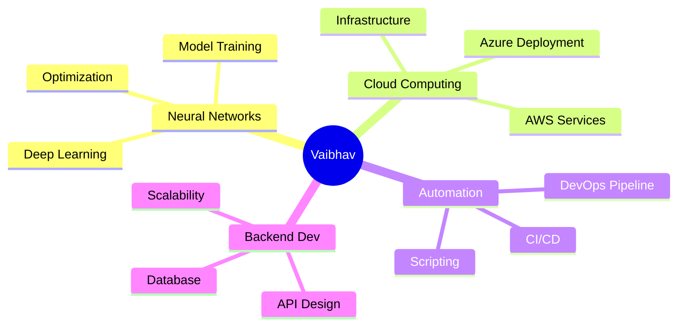

<div align="center">

<!-- Animated Header -->


<!-- Typing SVG -->
<a href="https://git.io/typing-svg"></a>

<!-- Profile Views Counter -->


<!-- Social Badges with Hover Effects -->
<p>
  <a href="https://twitter.com/VAlBHAV_"></a>
  <a href="https://www.linkedin.com/in/vaibhav-srivastava-63684477/"></a>
  <a href="https://instagram.com/vaibhav_fall"></a>
  <a href="mailto:vkluckymgs@gmail.com"></a>
</p>

</div>

<br>

<!-- About Me Section with Cool Design -->


##  About Me

```yaml
name: Vaibhav Srivastava
located_in: Lucknow, Uttar Pradesh, India
current_focus: Neural Network Based Systems
learning: Automation & DevOps
interests: [Cloud Computing, Backend Development, AI/ML]
email: vkluckymgs@gmail.com

fields_of_expertise:
  - Python Development
  - Backend Architecture
  - Cloud Deployment
  - System Automation
  
currently_working_on: 
  - Building Neural Network Systems 🧠
  - Exploring Cloud Infrastructure ☁️
  - Automating Workflows 🤖
```


<br>

<!-- Tech Stack Section -->
## 🛠️ My Tech Arsenal

<div align="center">

### 💻 Programming Languages
<p>
  
  
  
  
  
  
</p>

### 🌐 Frontend Development
<p>
  
  
  
  
  
  
</p>

### ⚙️ Backend & Databases
<p>
  
  
  
  
  
  
</p>

### ☁️ Cloud & DevOps
<p>
  
  
  
  
  
  
  
</p>

### 🤖 AI/ML & Tools
<p>
  
  
  
  
</p>

</div>


<br>

<!-- GitHub Stats Section -->
## 📊 GitHub Analytics

<div align="center">
  
  
</div>

<div align="center">
  
</div>

<div align="center">
  
</div>


<br>

<!-- GitHub Trophies -->
## 🏆 GitHub Achievements

<div align="center">
  
</div>


<br>

<!-- Current Projects Section -->
## 🚀 Current Focus

<div align="center">



</div>


<br>

<!-- Quote Section -->
## 💭 Dev Quote

<div align="center">
  


</div>


<!-- Fun Section -->
## 🎯 When I'm Not Coding...

<div align="center">

```javascript
const vaibhav = {
    code: ["Python", "JavaScript", "Java", "C++"],
    askMeAbout: ["web dev", "cloud", "neural networks", "automation"],
    technologies: {
        backEnd: ["Node.js", "Python", "Express"],
        frontEnd: ["React", "Vue.js", "Bootstrap"],
        cloud: ["AWS", "Azure", "Heroku"],
        databases: ["MySQL", "Firebase", "MongoDB", "CouchDB"],
        devOps: ["Docker", "Kubernetes", "Git", "Linux"],
        misc: ["TensorFlow", "PyTorch", "scikit-learn"]
    },
    currentFocus: "Building Neural Network Systems",
    funFact: "I debug with console.log() and I'm not ashamed! 😄"
};
```

</div>


<!-- Support Section -->
## 💖 Support My Work

<div align="center">

If you like my work, consider giving a ⭐ to my repositories!

<a href="https://www.buymeacoffee.com/vaibhavsrivastava" target="_blank"></a>

</div>

<br>

<!-- Snake Animation -->
<div align="center">
  
</div>

<br>

<!-- Footer Wave -->


<div align="center">
  
### ⭐ Show some ❤️ by starring repositories you find interesting!

</div>
