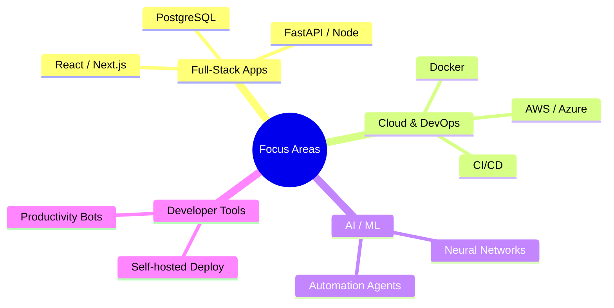

<div align="center">


[](https://git.io/typing-svg)


<br/>

[](https://twitter.com/VAlBHAV_)
[](https://www.linkedin.com/in/vaibhav-srivastava-63684477/)
[](https://instagram.com/vaibhav_fall)
[](mailto:vkluckymgs@gmail.com)
[](https://github.com/lucky12651)

</div>

---

## About Me

Hey there! I'm **Vaibhav Srivastava**, a full-stack developer based in **Noida, India**.

I build end-to-end products — from polished React/Next.js frontends to Python/Node backends, cloud deployment, and automation. Lately I've been diving deeper into **AI/ML**, **DevOps**, and self-hosted developer platforms.

```yaml
name: Vaibhav Srivastava
location: Noida, India
focus: Full-Stack · Cloud · AI/ML · Automation
stack: [Python, JavaScript/TypeScript, React, Node.js, Flutter, FastAPI]
email: vkluckymgs@gmail.com
status: Open to opportunities & collaborations
```

---

## Featured Projects

| Project | What it does | Stack |
|:--------|:-------------|:------|
| **[CoinCloud](https://github.com/lucky12651/CoinCloud)** | Multi-chain crypto wallet (BTC, LTC, ETH) | React · FastAPI · PostgreSQL |
| **[WireFringe](https://github.com/lucky12651/WireFringe)** | Modern blogging platform with RBAC admin & CMS | Next.js · FastAPI · PostgreSQL |
| **[Dailybugle](https://github.com/lucky12651/Dailybugle)** | URL shortener with analytics & custom links | Node.js · React · PostgreSQL |
| **[Compiler](https://github.com/lucky12651/Compiler)** | Online code compiler (Python, Java, C++, C) | Flask · Python |
| **[Amizone-bot](https://github.com/lucky12651/Amizone-bot)** | Telegram bot for attendance, exams & results | Python · Telegram API · Firebase |
| **[Irctc_Automation](https://github.com/lucky12651/Irctc_Automation)** | IRCTC train search & booking automation | Python · Selenium · Vision API |

<p align="center">
  <a href="https://github.com/lucky12651?tab=repositories">
    
  </a>
</p>

---

## Tech Stack

<div align="center">

**Languages**


**Frontend & Mobile**


**Backend & Databases**


**Cloud, DevOps & AI**


</div>

---

## GitHub Stats

<div align="center">


</div>

---

## Currently Exploring


```mermaid
mindmap
  root((Focus Areas))
    Full-Stack Apps
      React / Next.js
      FastAPI / Node
      PostgreSQL
    Cloud & DevOps
      Docker
      AWS / Azure
      CI/CD
    AI / ML
      Neural Networks
      Automation Agents
    Developer Tools
      Self-hosted Deploy
      Productivity Bots
```

---

## Connect With Me

<div align="center">

I'm always open to interesting projects, collaborations, and opportunities.

**[LinkedIn](https://www.linkedin.com/in/vaibhav-srivastava-63684477/)** · **[Twitter / X](https://twitter.com/VAlBHAV_)** · **[Email](mailto:vkluckymgs@gmail.com)** · **[GitHub](https://github.com/lucky12651)**

<br/>


<br/>


</div>


<div align="center">

### Thanks for visiting — star a repo if you find something useful!

</div>
